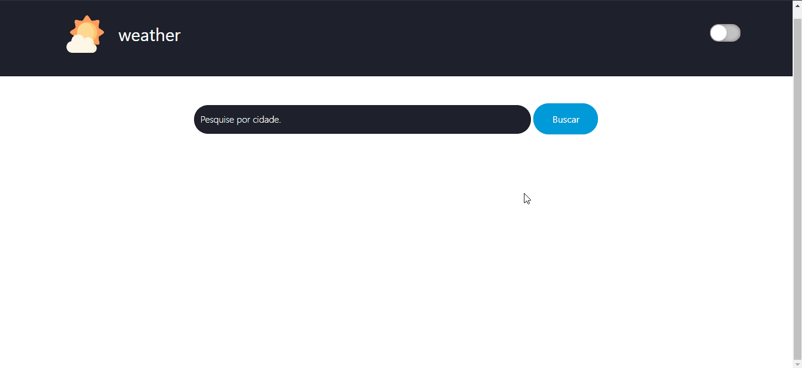

<h1 align="center">
 
WEATHER
</h1>

Veja como está o clima de qualquer região

  

[//]: # (Add your gifs/images here:)

  

## Features
[//]: # (Add the features of your project here:)
**Dark Mode** - Altere entre modo escuro e claro. Ao recarregar a página o tema se materá  
**Pesquisar** - Procure por regiões para ver o clima.
## Techs

✅ **HTML**  
✅ **CSS**  
✅ **JavaScript**  

## Demonstração

Clique na imagem para acessar o site

## License

This project is licensed under the MIT License - see the [LICENSE](https://opensource.org/licenses/MIT) page for details.
